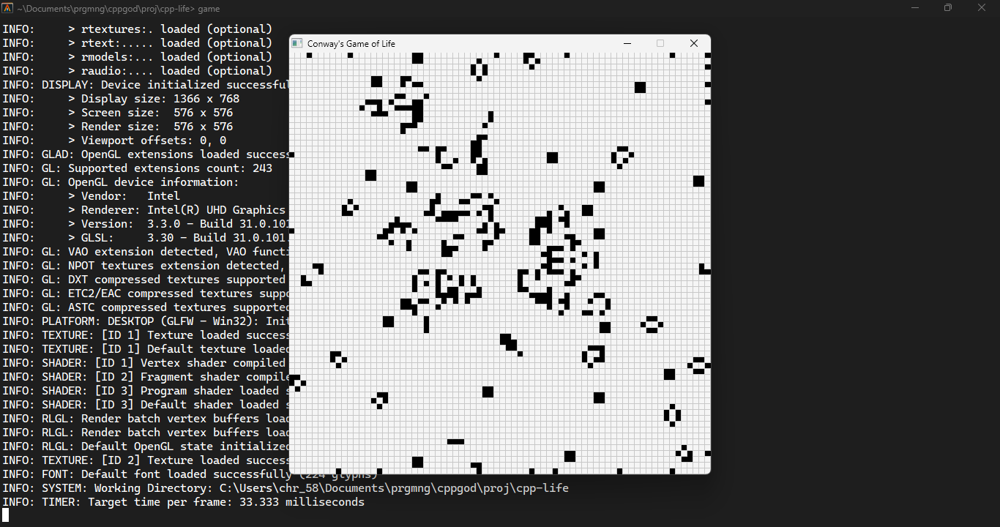

# conway's game of life in cpp

the [conways](https://en.wikipedia.org/wiki/Conway%27s_Game_of_Life) game of life in cplusplus using raylib graphics

------

>dependencies
- [raylib](https://www.raylib.com/)

------

------
## TODO

1. ~~added gui using raylib ~~
2. didnt make a interface to choose the live positions (will make it soon)
